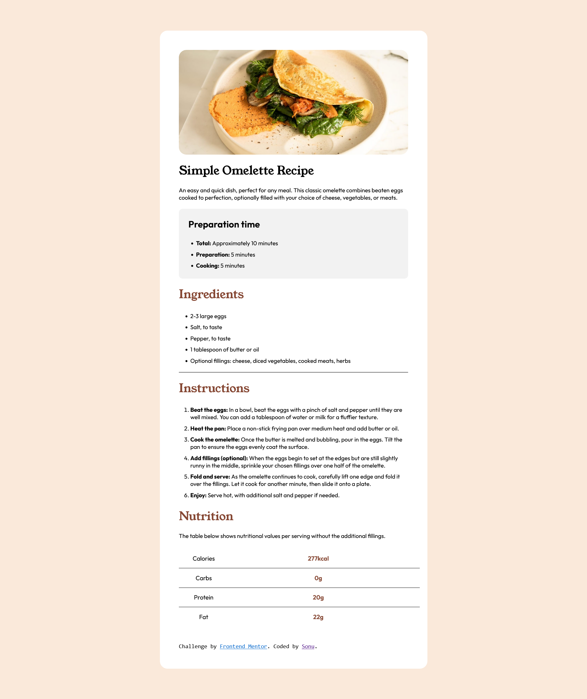

<<<<<<< HEAD
# Frontend Mentor - Social proof section solution

This is a solution to the [Social proof section challenge on Frontend Mentor](https://www.frontendmentor.io/challenges/social-proof-section-6e0qTv_bA). Frontend Mentor challenges help you improve your coding skills by building realistic projects. 

## Table of contents

- [Frontend Mentor - Social proof section solution](#frontend-mentor---social-proof-section-solution)
  - [Table of contents](#table-of-contents)
  - [Overview](#overview)
    - [The challenge](#the-challenge)
    - [Screenshot](#screenshot)
    - [Links](#links)
  - [My process](#my-process)
    - [Built with](#built-with)
    - [Useful resources](#useful-resources)

**Note: Delete this note and update the table of contents based on what sections you keep.**

## Overview

### The challenge

Users should be able to:

- View the optimal layout for the section depending on their device's screen size

### Screenshot

=======
# Frontend Mentor - Recipe page solution

This is a solution to the [Recipe page challenge on Frontend Mentor](https://www.frontendmentor.io/challenges/recipe-page-KiTsR8QQKm). Frontend Mentor challenges help you improve your coding skills by building realistic projects. 

## Overview

### Screenshot

>>>>>>> repo1/master

### Links

- Solution URL: [Solution URL](https://github.com/itsfingerlickinggood/1)
- Live Site URL: [Live site URL](https://itsfingerlickinggood.github.io/1/)

## My process

### Built with

<<<<<<< HEAD
- Semantic HTML5 markup
- CSS

### Useful resources

- [Example resource 1](https://www.openai.com) - ChatGPT
=======
- HTML
- CSS 
### What I learned

CSS flexbox and HTML tables

**Note: Delete this note and the content within this section and replace with your own learnings.**

### Continued development

CSS properties

### Useful resources
  The only resource i needed
- ChatGPT

## Author

- Website - [Sonu-x]

>>>>>>> repo1/master
